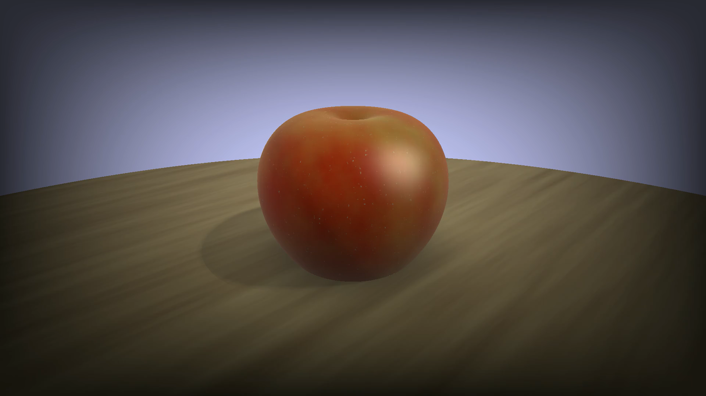

# Raymarching Experiment

This project is an experiment with raymarching techniques using OpenGL.
## Features

- **OpenGL**: Utilizes OpenGL for rendering a fullscreen quad and performing raymarching techniques in the fragment shader.
- **Signed Distance Functions (SDFs)**: Employs SDFs to create geometries and render shapes.
- **Fractal Brownian Motion (FBM)**: Implements FBM on value noise, and used it for coloring.
- **Phong Shading Model**.
- **Soft Shadows Techniques**.

## Demo Video

Check out the demo video [here](./D-Engine/Recordings/firstShader.mp4).

## References

- Special thanks to Inigo Quilez https://www.youtube.com/@InigoQuilez .
